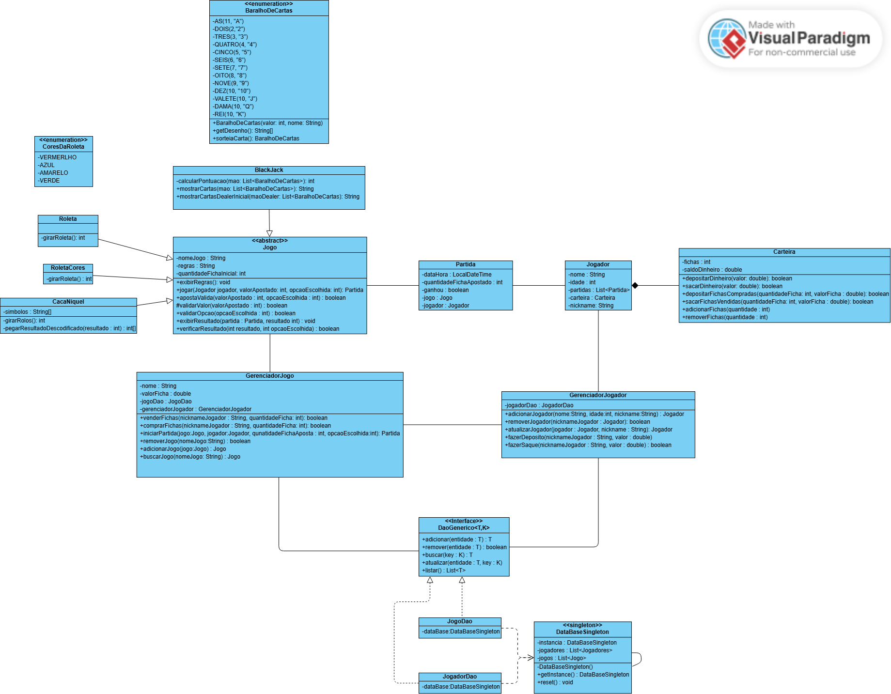
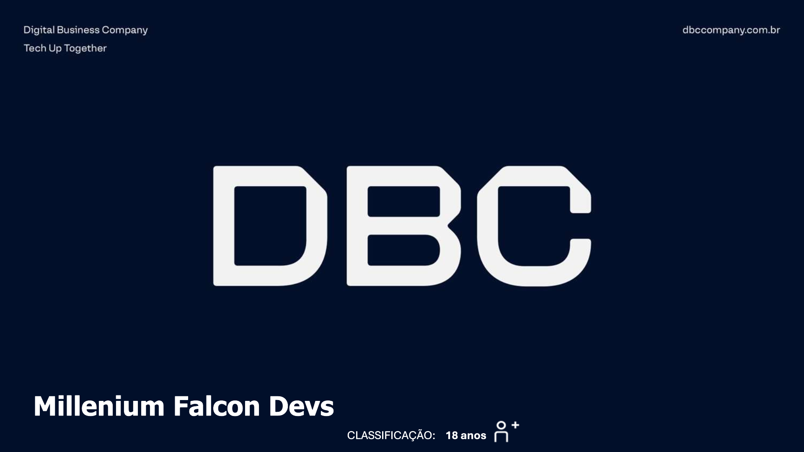
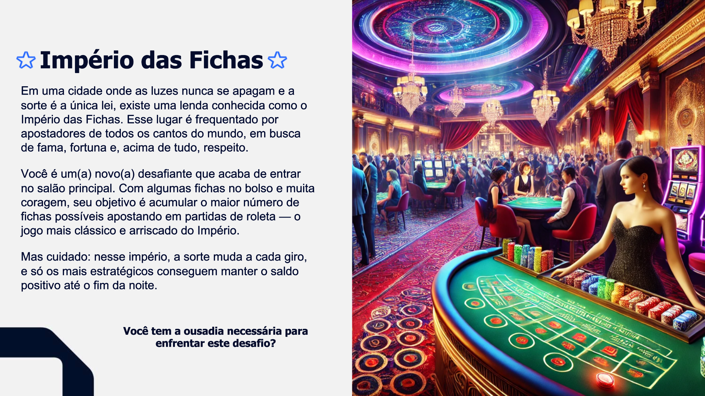
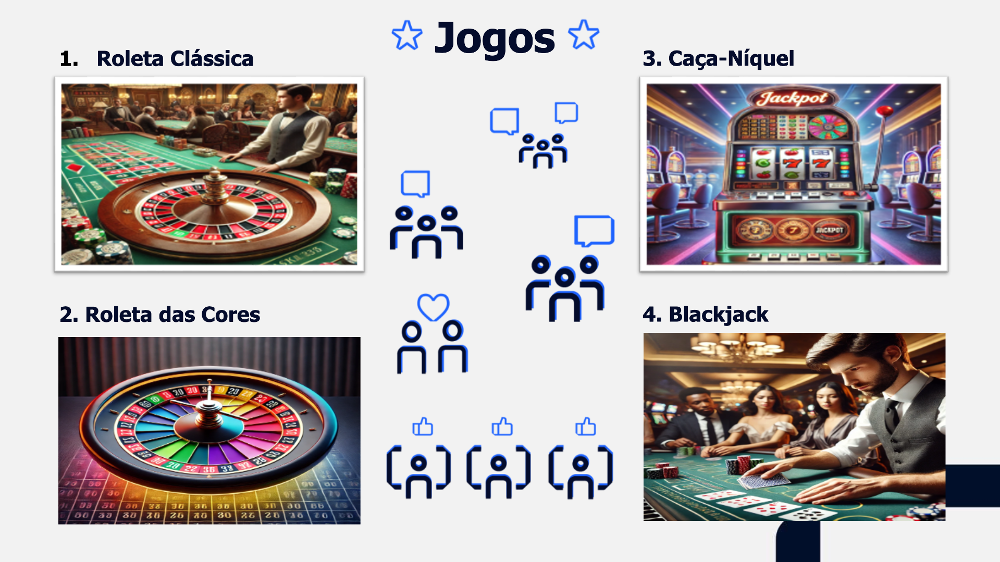
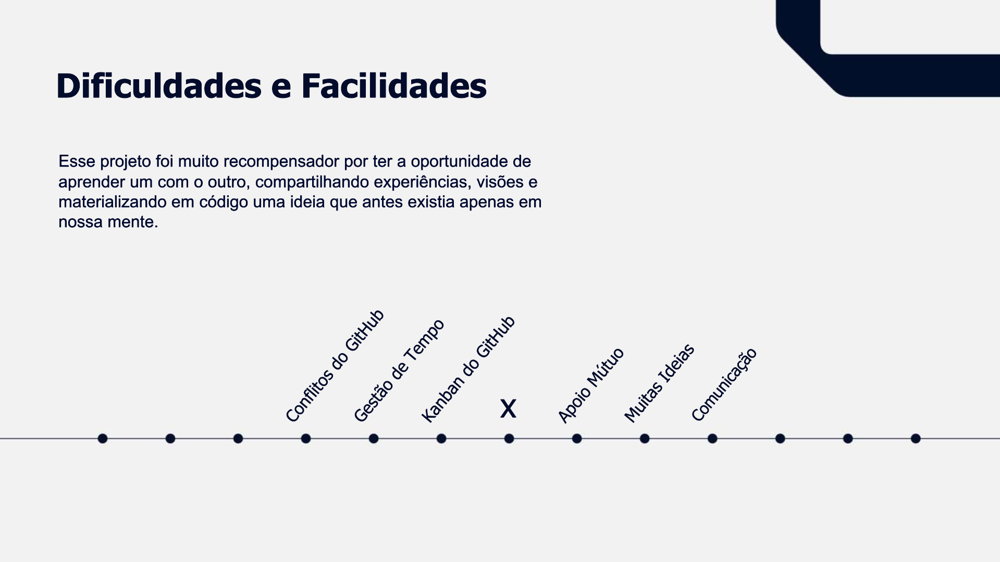
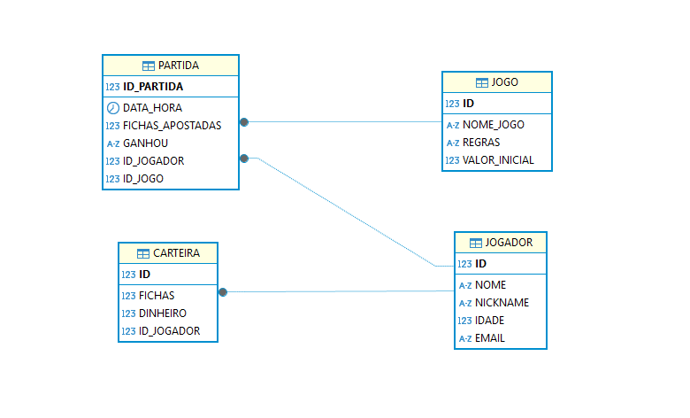

## 🃏 História e Contexto do Jogo – Império das Fichas 🎰

Em uma cidade onde as luzes nunca se apagam e a sorte é a única lei, existe uma lenda conhecida como o **Império das Fichas**. Esse lugar é frequentado por apostadores de todos os cantos do mundo, em busca de fama, fortuna e, acima de tudo, respeito.

Você é um(a) novo(a) desafiante que acaba de entrar no salão principal. Com algumas fichas no bolso e muita coragem, seu objetivo é **acumular o maior número de fichas possíveis** apostando em partidas de roleta — o jogo mais clássico e arriscado do Império.

Mas cuidado: nesse império, **a sorte muda a cada giro**, e só os mais estratégicos conseguem manter o saldo positivo até o fim da noite.

---

### 🎯 Objetivo do Jogo

O jogador começa com uma quantidade inicial de fichas. A cada rodada, pode fazer apostas:

- Em **números específicos** (ex: 17)
- Em **grupos (par ou ímpar)**

Com cada giro da roleta, o jogador descobre se venceu ou perdeu, e seu saldo de fichas é atualizado. O jogo continua até o jogador decidir sair ou ficar sem fichas.

A experiência de jogo foi expandida com novos jogos emocionantes:

- **Roleta Clássica:** Aposte em ⚪ PAR ou ⚫ ÍMPAR.
- **Roleta das Cores:** Aposte em 🔴 VERMELHO, 🔵 AZUL, 🟡 AMARELO ou 🟢 VERDE.
- **Caça Níquel:** Gire os rolos e espere para ver se você acerta a combinação.
- **Blackjack:** Compita contra o dealer para obter a mão mais próxima de 21.

---

### 🌍 Universo do Jogo

- Ambiente fictício de luxo com temática retrô e luzes de neon.
- Jogadores competem apenas contra a roleta (modo single player).
- Ambiente amigável, porém desafiador — o risco e a sorte estão sempre presentes.

---

## 🧭 Guia do Usuário – Etapa I

Este é um protótipo funcional em Java do jogo **Império das Fichas** 🎰. Siga as instruções abaixo para compilar, executar e interagir com o sistema no terminal.

### ⚙️ Requisitos

- ☕ **Java 8 ou superior** instalado
- 💻 Ambiente de desenvolvimento (como IntelliJ, Eclipse ou terminal com `javac`)
- 📁 Estrutura de diretórios organizada conforme abaixo:

```
src/
├── controller/
│   └── GerenciadorJogo.java
├── model/
│   ├── Carteira.java
│   ├── Jogador.java
│   ├── Jogo.java
│   ├── Partida.java
│   └── Roleta.java
```

> Obs.: A `main` com o nome **Império das Fichas** ainda será implementada, mas todas as funcionalidades já estão presentes nas classes.

### 🛠️ Como Compilar

```bash
javac src/model/*.java src/model/jogos/*.java src/model/jogos/blackjack/*.java src/model/jogos/cacaniquel/*.java src/model/jogos/roletas/*.java src/dao/*.java src/dao/db/*.java src/dao/interfaces/*.java src/exceptions/*.java src/controller/*.java src/view/*.java src/view/animacoes/*.java src/view/menus/*.java 
```

### ▶️ Como Executar

```bash
java -cp src view.ImperioDasFichas
```

### 🧪 Funcionalidades para Testar

- Cadastro de jogadores
- Jogo de roleta (par ou ímpar)
- Compra e venda de fichas
- Gerenciamento de saldo em fichas e dinheiro

### 📌 Testando com Classe Main Temporária

```java
package app;

import controller.GerenciadorJogo;
import model.Roleta;
import model.Jogador;

import java.util.ArrayList;

public class ImperioDasFichas {
    public static void main(String[] args) {
        Roleta roleta = new Roleta("Roleta Clássica", "Aposte em par ou ímpar");
        GerenciadorJogo jogo = new GerenciadorJogo("Império das Fichas", 5.0, new ArrayList<>());
        jogo.adicionarJogo(roleta);
        jogo.adicionarJogador(new Jogador("Ana", 21, "aninha21"));
        // continue seus testes aqui...
    }
}
```

---

## 🧩 Diagrama de Classes
## 🧠 Visão Geral do Diagrama de Classes

O Diagrama de Classes do projeto **Império das Fichas** representa a estrutura fundamental do sistema, organizando os elementos principais do jogo em classes, relacionamentos e responsabilidades bem definidas. Ele está dividido em duas partes, refletindo a evolução entre a Etapa I e a Etapa II do desenvolvimento.

---

### 🔹 Parte I – Estrutura Inicial

A primeira versão do diagrama foca na base funcional do jogo:

- 👤 **Jogador**: representa o usuário do sistema, com atributos como nome, idade e login. Está associado a uma Carteira, que gerencia o saldo de fichas e dinheiro.
- 💼 **Carteira**: responsável por controlar as operações de compra, venda e saldo de fichas.
- 🧩 **Jogo**: classe abstrata que define o comportamento geral de todos os jogos, sendo estendida pelas variações de roleta.
- 🎰 **Roleta**: implementação básica do jogo com lógica de aposta em par ou ímpar.
- 📜 **Partida**: guarda o histórico de uma jogada específica, incluindo aposta, resultado e jogador.
- 🧑‍💼 **GerenciadorJogo**: orquestra o funcionamento do sistema, coordenando jogos, jogadores e partidas.

---

### 🔸 Parte II – Expansão e Modularização

Na segunda parte, o sistema foi expandido com novos recursos e refatorado para melhor organização:

- 🗂️ O pacote `model.jogos` foi subdividido:
  - `roletas`: contém `Roleta`, `RoletaCores` e o enum `CoresDaRoleta`
  - `cacaniquel`: contém `CacaNiquel`
- 🧠 A classe abstrata `Jogo` continua sendo a base para os diferentes tipos de jogos.
- 💾 Camada `dao` foi adicionada, com:
  - Interfaces genéricas: `DaoGenerico`
  - Classes concretas: `JogadorDao`, `JogoDao`
  - Banco de dados simulado: `DataBaseSingleton`
- 🧭 Camada `controller` ampliada com `GerenciadorJogador` e `GerenciadorJogo`.
- ✏️ `Jogador` agora permite edição de nome e idade.
- 🕹️ Novos jogos implementados:
  - Roleta das Cores
  - Caça Níquel
  - (em breve: Blackjack)
- 🔁 Aplicação de conceitos como:
  - Herança
  - Composição e Agregação
  - Override e Overloading

---

### 🔹 Parte III – Evolução do Sistema: Persistência e Arquitetura Robusta

Com o amadurecimento do projeto, novas camadas foram inseridas para trazer escalabilidade, organização e persistência:


- 📁 **Camada `dao/`**: concentra a lógica de persistência dos objetos com uso do padrão Singleton.
- ⚙️ **Camada `service/`**: cuida da lógica de negócio da persistência e relatórios de apostas.
- 🧩 **Camada `util/`**: contém classes utilitárias para entrada de dados e manipulação de moedas.
- 🧠 **Camada `model/` aprimorada**: novos jogos adicionados (`BlackJack`), além de suporte a histórico, apostas, carteira etc.
- 👁 **Camada `view/`**: ponto de interação com o usuário continua sendo `ImperioDasFichas.java`.
- 🖼 **Pasta `images/`**: agora armazena todos os diagramas utilizados nas etapas do projeto.
- 🚀 **Ponto de entrada `app/`**: mantém a inicialização da aplicação separada da interface.

---
### 🔸 Parte IV – Refinamento e Expansão Final

Na Parte IV, o sistema foi refinado e expandido com o objetivo de consolidar a arquitetura e aprimorar a interação do usuário:

- 👤 **Jogador**: A classe `Jogador` foi ampliada para incluir a lógica de gerenciamento das partidas, com a adição de um conjunto de partidas e o gerenciamento da carteira de fichas e dinheiro.

- 💼 **Carteira**: A `Carteira` agora se conecta de forma mais robusta com o `Jogador`, permitindo operações de depósito, saque e compra/venda de fichas.

- 🎮 **Jogo**: A classe `Jogo` continuou sua evolução para suportar diferentes tipos de jogos com regras específicas e lógicas distintas, agora com uma implementação mais clara de interfaces e enumerações (como `BaralhoDeCartas` e `CoresDaRoleta`).

- 🎲 **Partida**: A classe `Partida` foi mantida para registrar o histórico das jogadas, com detalhes sobre as fichas apostadas, o resultado da partida, e a referência ao `Jogador` e ao `Jogo`.

- 🎮 **GerenciadorJogador**: O controlador responsável pela lógica de gerenciamento dos jogadores foi refinado, permitindo a edição e remoção de jogadores, além de integrar o gerenciamento das carteiras de forma eficiente.

- 🎰 **GerenciadorJogo**: O controlador de jogos foi aprimorado para lidar com a inicialização das partidas e a lógica dos diferentes jogos, coordenando as apostas e as interações com os jogadores de maneira eficiente.

- 🗄️ **Banco de Dados Simulado**: A estrutura de persistência foi centralizada através do `DataBaseSingleton`, mantendo as operações de adição, remoção e recuperação de dados em um único ponto.

- 🆕 **Novos Jogos**:
  - 🃏 **Blackjack**: Um novo jogo foi adicionado, com regras próprias baseadas no famoso jogo de cartas.
  - 🎰 **Roleta das Cores** e **Roleta Clássica**: Aprimoramento na implementação das roletas, com novos tipos de apostas.

- 🧑‍💻 **Refinamento de Código**:
  - A utilização de **Streams API** e o tratamento de **Exceções** foram integrados ao sistema, promovendo a robustez e a clareza do código.
  - Melhorias na **interatividade** do sistema, com menus otimizados e uma navegação mais fluida.

---

Essas alterações na arquitetura e nas implementações proporcionam um sistema mais robusto e eficiente, com uma melhor persistência de dados e uma estrutura de gerenciamento mais modularizada.


---

### 🎯 Objetivos do Diagrama

- Modularizar e organizar a lógica do jogo.
- Representar hierarquias e interações entre classes.
- Facilitar manutenções e expansões futuras baseadas em princípios de POO.

---

### 📸 Diagramas Visuais

**Parte I:**
<p align="center">
  
</p>

**Parte II:**
<p align="center">
  
</p>

**Parte III:**
<p align="center">
  
</p>

**Parte IV (FINAL)**
<p align="center">
  
</p>


---


## ⚠️ Erro no Commit

Durante o desenvolvimento, houve um erro em que um commit relacionado à **Parte II** do projeto foi realizado na **branch `main`**, quando deveria ter sido feito na **branch `develop`**.

---

## 🧭 Guia do Usuário – Etapa II

Novas implementações e melhorias significativas foram feitas. Veja abaixo como testar:

### ⚙️ Requisitos

- ☕ **Java 8 ou superior**
- 💻 IDE (IntelliJ, Eclipse) ou terminal com `javac`
- 📁 Estrutura de diretórios:

```
src/
├── controller/
│   ├── GerenciadorJogador.java
│   └── GerenciadorJogo.java
├── dao/
│   ├── JogadorDao.java
│   ├── JogoDao.java
│   ├── db/
│   │   └── DataBaseSingleton.java
│   └── interfaces/
│       └── DaoGenerico.java
├── model/
│   ├── Carteira.java
│   ├── Jogador.java
│   ├── Partida.java
│   └── jogos/
│       ├── Jogo.java
│       ├── cacaniquel/
│       │   └── CacaNiquel.java
│       └── roletas/
│           ├── Roleta.java
│           ├── RoletaCores.java
│           └── CoresDaRoleta.java
├── app/
│   └── ImperioDasFichas.java
└── view/
    └── ImperioDasFichas.java 
```

### 🛠️ Como Compilar

```bash
javac src/model/*.java src/model/jogos/*.java src/model/jogos/blackjack/*.java src/model/jogos/cacaniquel/*.java src/model/jogos/roletas/*.java src/dao/*.java src/dao/db/*.java src/dao/interfaces/*.java src/exceptions/*.java src/controller/*.java src/view/*.java src/view/animacoes/*.java src/view/menus/*.java 
```

### ▶️ Como Executar

```bash
java -cp src view.ImperioDasFichas
```

### 🧪 Funcionalidades para Testar

- Cadastro de jogadores
- Roleta Clássica e das Cores
- Caça Níquel
- Blackjack
- Gerenciamento de fichas e carteira
- Edição de perfil

### 📌 Classe Main Temporária

```java
package app;

import controller.GerenciadorJogo;
import model.Jogador;
import model.jogos.roletas.Roleta;
import model.jogos.roletas.RoletaCores;
import model.jogos.cacaniquel.CacaNiquel;

public class ImperioDasFichas {
    public static void main(String[] args) {
        Roleta roleta = new Roleta("Roleta Clássica", "Aposte em par ou ímpar");
        RoletaCores roletaCores = new RoletaCores("Roleta das Cores", "Aposte em uma cor.");
        CacaNiquel cacaNiquel = new CacaNiquel("Caça Níquel", "Aposte em símbolos.");

        GerenciadorJogo jogo = new GerenciadorJogo("Império das Fichas", 5.0);
        jogo.adicionarJogo(roleta);
        jogo.adicionarJogo(roletaCores);
        jogo.adicionarJogo(cacaNiquel);

        Jogador jogador = new Jogador("Ana", 21, "aninha21");
        jogo.adicionarJogador(jogador);
        jogo.comprarFicha("aninha21", 10);
        jogo.iniciarPartida(roleta, jogador, 5, 1);
    }
}
```

---

## 🛠️ Implementações e Refinamentos

1. **Overloading:** métodos para criar jogadores com ou sem fichas iniciais.
2. **Override:** `jogar()` foi sobrescrito em subclasses específicas.
3. **Interfaces e Enums:** `DaoGenerico` e `CoresDaRoleta`.
4. **Edição de Perfil:** o jogador pode editar nome e idade.
5. **Novos Jogos:** roletas, caça níquel e blackjack.
6. **Relacionamentos:** composição e agregação claras entre classes.
7. **Novo Menu:** com acesso direto a jogos e carteira.

---

## 🧭 Guia do Usuário – Etapa III

A Etapa III trouxe grandes refinamentos de estrutura, persistência e modularização do sistema.

### ⚙️ Requisitos

- ☕ Java 8 ou superior
- 📦 Biblioteca externa: GSON (para persistência JSON)

🔗 Baixar GSON: https://github.com/google/gson  
Ou usar via Maven/Gradle

```
Vs16-ProjetoFinalJavaPOO
├── .idea
├── imperioDasFichas
│   ├── src
│   │   ├── controller
│   │   │   ├── GerenciadorJogador.java
│   │   │   ├── GerenciadorJogo.java
│   │   ├── dao
│   │   │   ├── db
│   │   │   │   └── DataBaseSingleton.java
│   │   │   ├── interfaces
│   │   │   │   ├── DaoGenerico.java
│   │   │   │   ├── JogadorDao.java
│   │   │   │   ├── JogoDao.java
│   │   ├── images
│   │   │   ├── diagrama.png
│   │   │   ├── diagrama2.png
│   │   │   ├── diagrama3.png
│   │   ├── model
│   │   │   ├── jogos
│   │   │   │   ├── Carteira.java
│   │   │   │   ├── Jogador.java
│   │   │   │   ├── Partida.java
│   │   ├── view
│   │   │   ├── animacoes
│   │   │   │   ├── AnimacaoRoletaCores.java
│   │   │   │   ├── AnimacaoRoletaParImpar.java
│   │   │   ├── ImperioDasFichas.java
├── .gitignore
├── README.md
└── Vs16-ProjetoFinalJavaPOO.iml

```
### 🛠️ Como Compilar

```bash
javac src/model/*.java src/model/jogos/*.java src/model/jogos/blackjack/*.java src/model/jogos/cacaniquel/*.java src/model/jogos/roletas/*.java src/dao/*.java src/dao/db/*.java src/dao/interfaces/*.java src/exceptions/*.java src/controller/*.java src/view/*.java src/view/animacoes/*.java src/view/menus/*.java 
```
### ▶️ Como Executar

```bash
java -cp src view.ImperioDasFichas
```

## 🧪 Funcionalidades para Testar

- **Cadastro de Jogadores**

-  **Roleta Clássica** (Aposta em par ou ímpar)

-  **Roleta das Cores** (Aposta em cores)

- **Caça Níquel** (Aposte nos símbolos)

- **Blackjack** (Chegue o mais próximo de 21)

- **Compra e Venda de Fichas**

- **Gerenciamento de Carteira**

-  **Edição de Perfil de Jogador**

- **Exclusão de Conta**

### 📌 Classe Main Temporária

```java
package app;

import controller.GerenciadorJogo;
import model.Jogador;
import model.jogos.roletas.Roleta;
import model.jogos.roletas.RoletaCores;
import model.jogos.cacaniquel.CacaNiquel;
import model.jogos.blackjack.BlackJack;

public class ImperioDasFichas {
  public static void main(String[] args) {
    Roleta roleta = new Roleta("Roleta Clássica", "Aposte em par ou ímpar");
    RoletaCores roletaCores = new RoletaCores("Roleta das Cores", "Aposte em uma cor.");
    CacaNiquel cacaNiquel = new CacaNiquel("Caça Níquel", "Aposte em símbolos.");
    BlackJack blackJack = new BlackJack("BlackJack", "Chegue o mais próximo de 21");

    GerenciadorJogo jogo = new GerenciadorJogo("Império das Fichas", 5.0);
    jogo.adicionarJogo(roleta);
    jogo.adicionarJogo(roletaCores);
    jogo.adicionarJogo(cacaNiquel);
    jogo.adicionarJogo(blackJack);

    Jogador jogador = new Jogador("Ana", 21, "aninha21");
    jogo.adicionarJogador(jogador);
    jogo.comprarFicha("aninha21", 10);
    jogo.iniciarPartida(roleta, jogador, 5, 1);
  }
}
```

---
## 🛠️ Funcionalidades Implementadas

### CRUD Completo de Jogadores e Jogos

Agora, o sistema permite que o jogador realize operações CRUD sobre as entidades **Jogador** e **Jogo**, o que inclui:

- **Create**: Criar novos jogadores com fichas iniciais, bem como adicionar jogos ao sistema.
- **Read**: Listar todos os jogadores e jogos cadastrados.
- **Update**: Atualizar o nome e idade do jogador, além de editar as informações de um jogo (como suas regras e valores).
- **Delete**: Remover jogadores ou jogos do sistema.

### Uso Estratégico de Java Collections

Na Etapa III, foram aplicados os seguintes tipos de coleções:

- **HashMap**: Para o armazenamento eficiente de jogadores e jogos, com acesso rápido por chave (nickname para jogadores, nome do jogo para jogos).
- **ArrayList**: Para armazenar as partidas de cada jogador e as listas de jogos, garantindo a ordem das inserções.
- **HashSet**: Usado para garantir a unicidade de entidades (como habilidades do jogador ou tipos de itens raros).

### Persistência de Dados

A utilização de **GSON** permite que os dados de jogadores, jogos e partidas sejam armazenados e recuperados em formato JSON, melhorando a persistência do sistema.

---
# 🎰 Império das Fichas - Parte IV (Final)

## 📅 Entrega Final
Esta etapa foca na evolução do projeto do jogo, com ênfase na implementação de estruturas de dados, na melhoria da interatividade do usuário e no refinamento da documentação e do design do projeto.

## 🛠️ Funcionalidades Implementadas
- **Melhorias na Interatividade do Usuário:**
  - Interfaces mais intuitivas para o gerenciamento de jogador, carteiras e jogos.
  - Uso de animações e efeitos visuais para melhorar a experiência de jogo.

- **Estruturas de Dados:**
  - **Streams API:** Utilização de pipeline de Streams para melhorar o fluxo de dados e a manipulação de coleções.
  - **Arquitetura MVC (Model-View-Controller):** A aplicação foi refatorada para usar a arquitetura MVC, melhorando a organização do código e sua manutenção.
    - **Model:** Gerencia os dados e a lógica de negócios.
    - **View:** Responsável pela interface do usuário.
    - **Controller:** Atua como intermediário entre a View e o Model.

- **Refinamento do Código e Tratamentos de Exceções:**
  - O código foi refatorado para ser mais limpo, modular e de fácil manutenção.
  - Implementação de tratamentos de exceções para evitar falhas durante a execução do programa.

## 🎮 Funcionalidades para Testar
- **Cadastro de Jogadores:** Cadastrar jogadores e gerenciar perfis.
- **Roleta Clássica (⚪ Par/⚫ Ímpar):** Apostas em par ou ímpar.
- **Roleta das Cores (🌈):** Aposte em uma das quatro cores.
- **Caça Níquel (🎰):** Jogo de caça-níquel com animação.
- **Blackjack (🃏):** Tente se aproximar de 21 sem ultrapassar.
- **Gestão de Fichas:** Depósitos, saques, compra e venda de fichas.
- **Edição de Perfil:** Alteração de nome e idade.
- **Exclusão de Conta:** Remoção do jogador e seus dados.
- **Ranking de Vitoriosos:** Veja os jogadores com mais vitórias.

## 🧑‍💻 Arquitetura do Projeto

O projeto segue o padrão MVC, separando a lógica de negócios (Model), a interação com o usuário (View) e o controle de fluxo (Controller).

### Model
- **Jogador:** Representa os jogadores do jogo, com informações como nome, idade, nickname e carteiras.
- **Partida:** Representa uma partida de jogo, com detalhes sobre o valor apostado e o resultado.
- **Carteira:** Gerencia as fichas e o dinheiro do jogador.
- **Jogos:** Inclui as classes para cada jogo, como Roleta, Caça Níquel e Blackjack, com suas regras e lógicas de aposta.

### View
- **Menus:** Interfaces de interação com o usuário para cadastro, login, escolha de jogos e opções de edição de perfil.
- **Animações:** Efeitos visuais para jogos como a roleta e caça-níquel.

### Controller
- **GerenciadorJogador:** Gerencia as ações relacionadas aos jogadores, como adicionar, remover e atualizar jogadores.
- **GerenciadorJogo:** Gerencia os jogos, realizando a validação de apostas e início de partidas.

## 💻 Como Funciona

Após executar o programa, o usuário pode escolher entre as seguintes opções:
1. **Cadastrar um novo jogador** ou **fazer login**.
2. Jogar em uma **roleta clássica** ou **roleta das cores**.
3. Participar de uma **partida de Caça Níquel** ou **Blackjack**.
4. **Gerenciar sua carteira**, incluindo depósitos, saques e compra/venda de fichas.
5. **Visualizar o ranking de jogadores** e suas vitórias.


---
# Apresentação do Projeto: Império das Fichas 🎰

## 🌟 Slide 1: Logo e Introdução
<p align="center">
  
</p>

**Millennium Falcon Devs**  
*Digital Business Company*  
*Tech Up Together*

---

## 🌟 Slide 2: Introdução ao Jogo
<p align="center">
  
</p>

**Império das Fichas**  
Em uma cidade onde as luzes nunca se apagam, a sorte é a única lei. O Império das Fichas é um cassino onde jogadores de todo o mundo buscam fama e fortuna com a roleta e outros jogos.

---

## 🌟 Slide 3: Jogos Disponíveis
<p align="center">
  
</p>

**1. Roleta Clássica**  
**2. Roleta das Cores**  
**3. Caça-Níquel**  
**4. Blackjack**

---

## 🌟 Slide 4: Funcionalidades de Gerenciamento
<p align="center">
  
</p>

- Adicionar jogador (cadastro do jogador)
- Fazer login (apenas com o nickname)
- Editar dados da conta (nome, idade)
- Apagar conta
- Depositar dinheiro real
- Sacar dinheiro real
- Comprar fichas com dinheiro
- Vender fichas para obter dinheiro
- Ranking de jogadores

---

## 🌟 Slide 5: Dificuldades e Facilidades
<p align="center">
  
</p>

**Dificuldades e Facilidades**  
Esse projeto foi recompensador por ter a oportunidade de aprender um com o outro, compartilhando experiências e materializando em código uma ideia que antes existia apenas em nossa mente.

---

## 🌟 Slide 6: Logo Final
<p align="center">
  
</p>

**Let's Tech Up Together!**


---

## 📌 Kanban do Projeto
🔗 [Acompanhe o progresso no GitHub Projects](https://github.com/users/Gabssanjoss/projects/2/views/1)

### 📄 Documentações Complementares
- 📘 [Documentação Parte I](https://docs.google.com/document/d/1SkGvNKpYJEhrUCNLDj0wGpJakQ-BM0v1d6-iYQ-4VUU/edit?tab=t.0)
- 📗 [Documentação Parte II](https://docs.google.com/document/d/1XGEqtFKpWVb0Fm37gq6mGFiUD9ws1VnzB9-PYKBoT90/edit?tab=t.0)
- 📙 [Documentação Parte III](https://docs.google.com/document/d/1hVkk-CDQ6Z0ZrZRETjihxU5VxTsr5PL9WpjzE6Ry_Xc/edit?tab=t.0#heading=h.xsv6duk44xm3)
- 📕 [Documentação Parte IV - Final](https://docs.google.com/document/d/1TKRO3fOsQNEC_bfpgl6S8MU_eCEhfd6Kv9hO2v24h0s/edit?usp=classroom_web&authuser=0)

[📊 Visualizar os Slides de Apresentação](https://dbccompany-my.sharepoint.com/:p:/g/personal/gabriela_chaves_dbccompany_com_br/EYhN04d2PplHvxy5UD03hnUBLqqKLZo1_2MsbVsmTu-1Dw?e=UcAaWW&nav=eyJzSWQiOjI3OCwiY0lkIjozNjQ0MzE1MzcyfQ)


---

## 👥 Millenium Falcon Developers

👩‍💼 **Tech Lead:** Gabriela Anjos

👨‍💻 **Desenvolvedores:**
- Lucas Feitosa
- William Augusto
- Robson Batista
- Silvia Cristina

---

# 🎰 Império das Fichas - Spring Web

## 🧭 Guia do Usuário

Projeto foi migrado para Spring com Maven. Novas implementações e melhorias significativas foram feitas. Veja abaixo como testar:

### ⚙️ Requisitos

- ☕ **Java 17 ou superior instalado**
- 💻 **IDE** (IntelliJ, Eclipse)
- 🐳 **Docker** instalado
- 🗃️ **DBeaver** (ou outro cliente para conectar ao banco Oracle)
- 📁 Estrutura de diretórios:

```
Vs16-ProjetoFinalJavaPOO
├── .idea
├── src
│   └── main
│       ├── java
│       │   └── br.com.dbc.vemser.imperiodasfichas
│       │       ├── config
│       │       ├── controllers
│       │       ├── database
│       │       ├── documentacao
│       │       ├── dtos
│       │       ├── entities
│       │       ├── enums
│       │       ├── exceptions
│       │       ├── repositories
│       │       ├── services
│       │       └── ImperiodasfichasApplication.java
│       └── resources
│           ├── bd
│           │   ├── criar_esquema_jogo.sql
│           │   ├── criar.sql
│           │   └── dados.sql
│           ├── images
│           ├── static
│           ├── templates
│           └── application.properties
├── test
├── .gitignore
├── HELP.md
├── mvnw
├── mvnw.cmd
├── pom.xml
└── README.md
```

---

## 🐳 Inicialização do Banco Oracle com Docker

Rode o comando abaixo no terminal para subir o banco Oracle localmente com Docker:
```
docker run -d --name bd-oracle -p 1521:1521 --restart=unless-stopped -e ORACLE_ALLOW_REMOTE=true -e ORACLE_PASSWORD=oracle -e RELAX_SECURITY=1 -v bd-oracle:/u01/app/oracle epiclabs/docker-oracle-xe-11g
```

⚠️ Este banco roda localmente e as credenciais utilizadas são padrão para fins de testes e desenvolvimento.

## 📂 3. Execução dos Scripts SQL

Cire uma conexão com o banco pelo DBevaer, acesse a pasta `src/main/resources/bd` do projeto e execute os arquivos a seguir **na ordem indicada**:

1. `criar_esquema_jogo.sql` – Cria o schema (jogo) da aplicação.
2. `criar.sql` – Cria as tabelas no banco.
3. `dados.sql` – Insere os dados iniciais.

---

## ⚙️ Configuração de VM Options na IDE


Para rodar o projeto localmente, adicione os seguintes parâmetros em sua IDE (Ex: IntelliJ > Edit Configurations > VM options):

```
-Dspring.mail.username=seu.email@gmail.com
-Dspring.mail.password="senha gerada pelo gmail"
-Ddb.url=jdbc:oracle:thin:@localhost:1521:xe
-Ddb.user=system
-Ddb.password=oracle
-Ddb.schema=JOGO
```

ℹ️ Essas configurações são voltadas para **ambiente de testes e desenvolvimento**, estão informadas aqui para facilitar a execução do projeto.

### 📸 Diagrama-ER

<p align="center">
  
</p>

---


## 🔍 Endpoints Disponíveis (Documentados no Swagger)

> 📄 A documentação completa da API pode ser acessada via Swagger após iniciar a aplicação:  
> 🔗 [http://localhost:8080](http://localhost:8080)

- **🎮 Jogo:**
  - Listar todos os jogos
  - Buscar jogo por ID
  - Criar um novo jogo
  - Atualizar um jogo
  - Deletar um jogo por ID


- **👤‍ Jogador:**
  - Listar todos os jogadores
  - Buscar jogador por ID
  - Criar um novo jogador
  - Atualizar um jogador
  - Deletar um jogador por ID
  - Listar ranking dos jogadores


- **💼 Carteira:**
  - Listar todas as carteiras
  - Buscar carteira por ID
  - Buscar carteira pelo ID do jogador
  - Atualizar carteira
  - Depositar e sacar dinheiro pela carteira (ID)
  - Comprar e vender fichas pela carteira (ID)


- **🎲 Jogada:**
  - Jogar Roleta Clássica (Par/Ímpar)
  - Jogar Roleta das Cores
  - Jogar Caça-Níquel


- **🏆 Partida:**
  - Listar todas as partidas
  - Buscar uma partida por ID
  - Deletar uma partida por ID

---

## 📌 Kanban do Projeto
🔗 [Acompanhe o progresso no GitHub Projects](https://github.com/users/Gabssanjoss/projects/2/views/1)

---

## 👥 Time Técnico

👩‍💼 **Tech Lead:** Silvia Cristina

👨‍💻 **Desenvolvedores:**
- William Augusto
- Daniele Lins

---
# 🛠️ Implementação do Spring Data (JPA)

## 🗺️ Mapeamento de Entidades
As entidades do projeto foram mapeadas para refletir as tabelas do banco de dados Oracle, utilizando anotações do JPA:
- **@Entity**: Define a classe como uma entidade JPA.
- **@Id**: Marca o campo como a chave primária da entidade.
- **@GeneratedValue**: Define a estratégia de geração de valores para a chave primária.
- **@Column**: Mapeia o campo para uma coluna específica na tabela.
- **@ManyToOne, @OneToMany, @ManyToMany**: Define os relacionamentos entre as entidades, modificando-as para referenciar diretamente as tabelas por meio de objetos e `Sets<>`.
- **@JoinColumn**: Especifica a coluna de junção para relacionamentos.
- **@Enumerated**: Mapeia enums para colunas do banco de dados.
- **@JsonIgnore**: Ignora o campo durante a serialização JSON.

## 🗂️ Novos Repositories
Os repositories foram alterados para serem interfaces que estendem `JpaRepository`, permitindo operações CRUD 
automáticas e consultas personalizadas. Destaques:
1. **JogadorRepository**: 
   - Uso de Optional nos métodos `findByNickname()` e `findByEmail()`;
   - Uso de `@Query` para os relatórios `relatorioJogadoresSimples()`, `relatorioJogadoresSimplesPaginado()`, 
     `getRankingPorVitorias()` e `getRankingPorVitoriasPaginado()`.
   - Uso de paginação com `Pageable` para os relatórios e rankings.
   - Uso de `@Param` para os métodos do ranking para aceitar o `idJogador` como parâmetro.
2. **JogoRepository**:
   - Uso de método personalizado `findByNomeJogo()` para buscar jogos pelo nome.
3. **CarteiraRepository**:
   - Uso de Optional no método `findByJogadorIdJogador()` para buscar a carteira de um jogador específico.

## 💱 Atualização dos Services
Os serviços foram atualizados para utilizar os novos repositories e implementar a lógica de negócios, destacando-se 
o uso de métodos nativos do JPA para operações CRUD, como `save()`, `findById()`, `delete()`, além dos métodos 
personalizados. Destaca-se o uso de paginação também nos métodos `listPaginado()` de `JogadorService` e `listarPaginado
()` de `PartidaService`, que agora recebem um objeto `Pageable` como parâmetro para controlar a paginação dos resultados.

## 📃 Novos DTOs
Foram criados novos DTOs (Data Transfer Objects) para encapsular os dados dos relatórios e dos rankings que serão 
enviados e recebidos pela API:
- **JogadorRankingDTO**: Representa o ranking de jogadores com o número de vitórias.
- **RelatórioJogadorSimplesDTO**: Representa um jogador com informações básicas + sua quantidade de fichas e dinheiro.

## 🎮 Atualização dos Controllers
Os controllers foram atualizados para refletir as mudanças nas entidades, repositories e services. Destaques:
- **JogadorController**:
  - Implementação de endpoints para os relatórios e rankings, utilizando os novos DTOs.
  - Uso de `@GetMapping` com `@RequestParam` para aceitar parâmetros de consulta, como `page` e `size`, para paginação.
- Atualização de toda a documentação Swagger para refletir as novas rotas e DTOs.

## 🍽️ Coleção do Postman
A coleção do Postman foi atualizada para refletir as novas rotas e funcionalidades implementadas no projeto. Ela 
pode ser encontrada na raíz do projeto, no arquivo `Imperio das Fichas API.postman_collection.json`. Como utilizar:
1. Abra o Postman.
2. Clique em "Importar" e selecione o arquivo `Imperio das Fichas API.postman_collection.json`.
3. Após a importação, você verá todas as rotas disponíveis.

## ➕ Funcionalidade Extra
O método `buscarPorNomeJogo()` implementa o método `normalizar()` que utiliza o `Normalizer` do Java para normalizar o 
nome do jogo, removendo acentos e caracteres especiais, facilitando a busca por jogos com nomes semelhantes, tendo 
em vista que o nome do Jogo é um Enum e não uma String.

## 👥 Time Técnico

👩‍💼 **Tech Lead:** Milena Soares

👨‍💻 **Desenvolvedores:**
- Daniele Lins
- Sara Salles
- Silvia Cristina