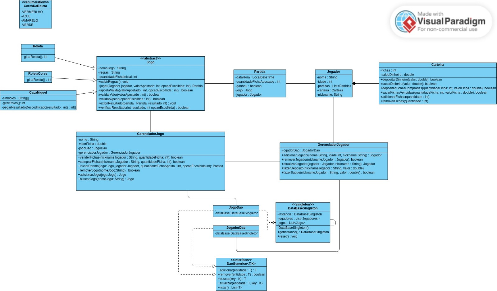
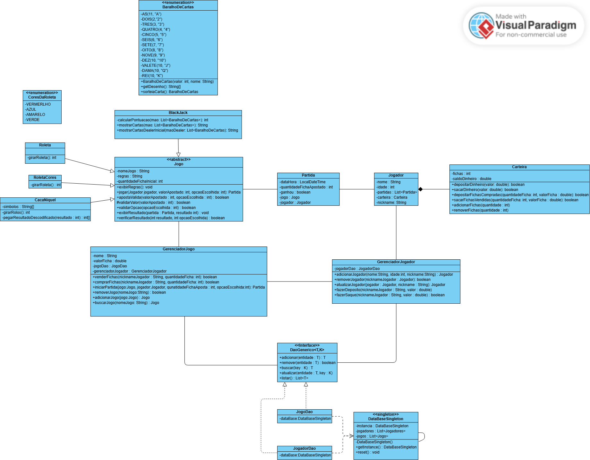

## 🃏 História e Contexto do Jogo – Império das Fichas 🎰

Em uma cidade onde as luzes nunca se apagam e a sorte é a única lei, existe uma lenda conhecida como o **Império das Fichas**. Esse lugar é frequentado por apostadores de todos os cantos do mundo, em busca de fama, fortuna e, acima de tudo, respeito.

Você é um(a) novo(a) desafiante que acaba de entrar no salão principal. Com algumas fichas no bolso e muita coragem, seu objetivo é **acumular o maior número de fichas possíveis** apostando em partidas de roleta — o jogo mais clássico e arriscado do Império.

Mas cuidado: nesse império, **a sorte muda a cada giro**, e só os mais estratégicos conseguem manter o saldo positivo até o fim da noite.

---

### 🎯 Objetivo do Jogo

O jogador começa com uma quantidade inicial de fichas. A cada rodada, pode fazer apostas:

- Em **números específicos** (ex: 17)
- Em **grupos (par ou ímpar)**

Com cada giro da roleta, o jogador descobre se venceu ou perdeu, e seu saldo de fichas é atualizado. O jogo continua até o jogador decidir sair ou ficar sem fichas.

A experiência de jogo foi expandida com novos jogos emocionantes:

- **Roleta Clássica:** Aposte em ⚪ PAR ou ⚫ ÍMPAR.
- **Roleta das Cores:** Aposte em 🔴 VERMELHO, 🔵 AZUL, 🟡 AMARELO ou 🟢 VERDE.
- **Caça Níquel:** Gire os rolos e espere para ver se você acerta a combinação.
- **Blackjack:** Compita contra o dealer para obter a mão mais próxima de 21.

---

### 🌍 Universo do Jogo

- Ambiente fictício de luxo com temática retrô e luzes de neon.
- Jogadores competem apenas contra a roleta (modo single player).
- Ambiente amigável, porém desafiador — o risco e a sorte estão sempre presentes.

---

## 🧭 Guia do Usuário – Etapa I

Este é um protótipo funcional em Java do jogo **Império das Fichas** 🎰. Siga as instruções abaixo para compilar, executar e interagir com o sistema no terminal.

### ⚙️ Requisitos

- ☕ **Java 8 ou superior** instalado
- 💻 Ambiente de desenvolvimento (como IntelliJ, Eclipse ou terminal com `javac`)
- 📁 Estrutura de diretórios organizada conforme abaixo:

```
src/
├── controller/
│   └── GerenciadorJogo.java
├── model/
│   ├── Carteira.java
│   ├── Jogador.java
│   ├── Jogo.java
│   ├── Partida.java
│   └── Roleta.java
```

> Obs.: A `main` com o nome **Império das Fichas** ainda será implementada, mas todas as funcionalidades já estão presentes nas classes.

### 🛠️ Como Compilar

```bash
javac -d out src/model/*.java src/controller/*.java src/app/ImperioDasFichas.java
```

### ▶️ Como Executar

```bash
java -cp out app.ImperioDasFichas
```

### 🧪 Funcionalidades para Testar

- 👤 Cadastro de jogadores
- 🎰 Jogo de roleta (par ou ímpar)
- 💰 Compra e venda de fichas
- 👜 Gerenciamento de saldo em fichas e dinheiro

### 📌 Testando com Classe Main Temporária

```java
package app;

import controller.GerenciadorJogo;
import model.Roleta;
import model.Jogador;

import java.util.ArrayList;

public class ImperioDasFichas {
    public static void main(String[] args) {
        Roleta roleta = new Roleta("Roleta Clássica", "Aposte em par ou ímpar");
        GerenciadorJogo jogo = new GerenciadorJogo("Império das Fichas", 5.0, new ArrayList<>());
        jogo.adicionarJogo(roleta);
        jogo.adicionarJogador(new Jogador("Ana", 21, "aninha21"));
        // continue seus testes aqui...
    }
}
```

---

## 🧩 Diagrama de Classes
## 🧠 Visão Geral do Diagrama de Classes

O Diagrama de Classes do projeto **Império das Fichas** representa a estrutura fundamental do sistema, organizando os elementos principais do jogo em classes, relacionamentos e responsabilidades bem definidas. Ele está dividido em duas partes, refletindo a evolução entre a Etapa I e a Etapa II do desenvolvimento.

---

### 🔹 Parte I – Estrutura Inicial

A primeira versão do diagrama foca na base funcional do jogo:

- 👤 **Jogador**: representa o usuário do sistema, com atributos como nome, idade e login. Está associado a uma Carteira, que gerencia o saldo de fichas e dinheiro.
- 💼 **Carteira**: responsável por controlar as operações de compra, venda e saldo de fichas.
- 🧩 **Jogo**: classe abstrata que define o comportamento geral de todos os jogos, sendo estendida pelas variações de roleta.
- 🎰 **Roleta**: implementação básica do jogo com lógica de aposta em par ou ímpar.
- 📜 **Partida**: guarda o histórico de uma jogada específica, incluindo aposta, resultado e jogador.
- 🧑‍💼 **GerenciadorJogo**: orquestra o funcionamento do sistema, coordenando jogos, jogadores e partidas.

---

### 🔸 Parte II – Expansão e Modularização

Na segunda parte, o sistema foi expandido com novos recursos e refatorado para melhor organização:

- 🗂️ O pacote `model.jogos` foi subdividido:
  - `roletas`: contém `Roleta`, `RoletaCores` e o enum `CoresDaRoleta`
  - `cacaniquel`: contém `CacaNiquel`
- 🧠 A classe abstrata `Jogo` continua sendo a base para os diferentes tipos de jogos.
- 💾 Camada `dao` foi adicionada, com:
  - Interfaces genéricas: `DaoGenerico`
  - Classes concretas: `JogadorDao`, `JogoDao`
  - Banco de dados simulado: `DataBaseSingleton`
- 🧭 Camada `controller` ampliada com `GerenciadorJogador` e `GerenciadorJogo`.
- ✏️ `Jogador` agora permite edição de nome e idade.
- 🕹️ Novos jogos implementados:
  - Roleta das Cores
  - Caça Níquel
  - (em breve: Blackjack)
- 🔁 Aplicação de conceitos como:
  - Herança
  - Composição e Agregação
  - Override e Overloading

---

### 🔹 Parte III – Evolução do Sistema com Persistência e Arquitetura Mais Robusta

A Parte III trouxe refinamentos significativos para o sistema, focando na persistência de dados e uma arquitetura mais robusta. Aqui estão os pontos principais:

### **Classes de Jogo**
A classe `Jogo` é a classe base para os diferentes tipos de jogos, como `Roleta`, `RoletaCores`, `CacaNiquel` e `BlackJack`, cada um com suas regras e lógica de jogo específicas.

- **Roleta**: Contém o método `girarRoleta()` para gerar os resultados da roleta.
- **RoletaCores**: Implementa uma roleta com cores específicas.
- **CacaNiquel**: Jogo baseado em símbolos que são sorteados.
- **BlackJack**: Jogo de cartas, onde o objetivo é se aproximar de 21 pontos sem ultrapassá-los.

### **Persistência de Dados**
A utilização do `DataBaseSingleton` melhora a persistência dos dados, permitindo o gerenciamento de entidades como `Jogador`, `Jogo` e `Partida` com um armazenamento centralizado, acessível por toda a aplicação.

### **Gerenciamento de Jogadores e Jogos**
- **GerenciadorJogador**: Agora possui métodos para manipulação CRUD de jogadores, incluindo adição, remoção, atualização e busca de jogadores.
- **GerenciadorJogo**: Gerencia a criação e remoção de jogos, além de iniciar partidas baseadas nas apostas feitas pelos jogadores.

### **Entidades do Jogo**
- **Jogador**: Mantém informações sobre o jogador, como nome, idade, nickname, e a carteira associada com fichas e dinheiro.
  - A classe `Carteira` gerencia a compra, venda e o saldo de fichas.
- **Partida**: Registra o histórico de uma rodada, incluindo o jogo, a quantidade de fichas apostadas, e o resultado (vitória ou derrota).

### **Classes de DAO**
A implementação das interfaces de DAO (`DaoGenerico`) e classes específicas como `JogadorDao` e `JogoDao` facilitam o gerenciamento de entidades com operações de CRUD para persistência dos dados.

### **Estrutura de Dados e Lógica Avançada**
- **HashMap**: Usado para o armazenamento de jogos e jogadores, permitindo acesso rápido usando chaves, como o nickname do jogador ou o nome do jogo.
- **ArrayList**: Utilizado para armazenar as partidas de cada jogador e a lista de jogos, garantindo a ordem das inserções.
- **HashSet**: Usado para garantir a unicidade de entidades, como habilidades do jogador ou tipos de itens raros.

---

Essas alterações na arquitetura e nas implementações proporcionam um sistema mais robusto e eficiente, com uma melhor persistência de dados e uma estrutura de gerenciamento mais modularizada.


---

### 🎯 Objetivos do Diagrama

- Modularizar e organizar a lógica do jogo.
- Representar hierarquias e interações entre classes.
- Facilitar manutenções e expansões futuras baseadas em princípios de POO.

---

### 📸 Diagramas Visuais

**Parte I:**
<p align="center">
  
</p>

**Parte II:**
<p align="center">
  
</p>

**Parte III:**
<p align="center">
  
</p>

---


## ⚠️ Erro no Commit

Durante o desenvolvimento, houve um erro em que um commit relacionado à **Parte II** do projeto foi realizado na **branch `main`**, quando deveria ter sido feito na **branch `develop`**.

---

## 🧭 Guia do Usuário – Etapa II

Novas implementações e melhorias significativas foram feitas. Veja abaixo como testar:

### ⚙️ Requisitos

- ☕ **Java 8 ou superior**
- 💻 IDE (IntelliJ, Eclipse) ou terminal com `javac`
- 📁 Estrutura de diretórios:

```
src/
├── controller/
│   ├── GerenciadorJogador.java
│   └── GerenciadorJogo.java
├── dao/
│   ├── JogadorDao.java
│   ├── JogoDao.java
│   ├── db/
│   │   └── DataBaseSingleton.java
│   └── interfaces/
│       └── DaoGenerico.java
├── model/
│   ├── Carteira.java
│   ├── Jogador.java
│   ├── Partida.java
│   └── jogos/
│       ├── Jogo.java
│       ├── cacaniquel/
│       │   └── CacaNiquel.java
│       └── roletas/
│           ├── Roleta.java
│           ├── RoletaCores.java
│           └── CoresDaRoleta.java
├── app/
│   └── ImperioDasFichas.java
└── view/
    └── ImperioDasFichas.java 
```

### 🛠️ Como Compilar

```bash
javac -d out src/model/*.java src/controller/*.java src/app/ImperioDasFichas.java
```

### ▶️ Como Executar

```bash
java -cp out app.ImperioDasFichas
```

### 🧪 Funcionalidades para Testar

- Cadastro de jogadores
- Roleta Clássica e das Cores
- Caça Níquel
- Blackjack
- Gerenciamento de fichas e carteira
- Edição de perfil

### 📌 Classe Main Temporária

```java
package app;

import controller.GerenciadorJogo;
import model.Jogador;
import model.jogos.roletas.Roleta;
import model.jogos.roletas.RoletaCores;
import model.jogos.cacaniquel.CacaNiquel;

public class ImperioDasFichas {
    public static void main(String[] args) {
        Roleta roleta = new Roleta("Roleta Clássica", "Aposte em par ou ímpar");
        RoletaCores roletaCores = new RoletaCores("Roleta das Cores", "Aposte em uma cor.");
        CacaNiquel cacaNiquel = new CacaNiquel("Caça Níquel", "Aposte em símbolos.");

        GerenciadorJogo jogo = new GerenciadorJogo("Império das Fichas", 5.0);
        jogo.adicionarJogo(roleta);
        jogo.adicionarJogo(roletaCores);
        jogo.adicionarJogo(cacaNiquel);

        Jogador jogador = new Jogador("Ana", 21, "aninha21");
        jogo.adicionarJogador(jogador);
        jogo.comprarFicha("aninha21", 10);
        jogo.iniciarPartida(roleta, jogador, 5, 1);
    }
}
```

---

## 🛠️ Implementações e Refinamentos

1. **Overloading:** métodos para criar jogadores com ou sem fichas iniciais.
2. **Override:** `jogar()` foi sobrescrito em subclasses específicas.
3. **Interfaces e Enums:** `DaoGenerico` e `CoresDaRoleta`.
4. **Edição de Perfil:** o jogador pode editar nome e idade.
5. **Novos Jogos:** roletas, caça níquel e blackjack.
6. **Relacionamentos:** composição e agregação claras entre classes.
7. **Novo Menu:** com acesso direto a jogos e carteira.

---

## 🧭 Guia do Usuário – Etapa III

A Etapa III trouxe grandes refinamentos de estrutura, persistência e modularização do sistema.

### ⚙️ Requisitos

- ☕ Java 8 ou superior
- 📦 Biblioteca externa: GSON (para persistência JSON)

🔗 Baixar GSON: https://github.com/google/gson  
Ou usar via Maven/Gradle

```
Vs16-ProjetoFinalJavaPOO
├── .idea
├── imperioDasFichas
│   ├── src
│   │   ├── controller
│   │   │   ├── GerenciadorJogador.java
│   │   │   ├── GerenciadorJogo.java
│   │   ├── dao
│   │   │   ├── db
│   │   │   │   └── DataBaseSingleton.java
│   │   │   ├── interfaces
│   │   │   │   ├── DaoGenerico.java
│   │   │   │   ├── JogadorDao.java
│   │   │   │   ├── JogoDao.java
│   │   ├── images
│   │   │   ├── diagrama.png
│   │   │   ├── diagrama2.png
│   │   │   ├── diagrama3.png
│   │   ├── model
│   │   │   ├── jogos
│   │   │   │   ├── Carteira.java
│   │   │   │   ├── Jogador.java
│   │   │   │   ├── Partida.java
│   │   ├── view
│   │   │   ├── animacoes
│   │   │   │   ├── AnimacaoRoletaCores.java
│   │   │   │   ├── AnimacaoRoletaParImpar.java
│   │   │   ├── ImperioDasFichas.java
├── .gitignore
├── README.md
└── Vs16-ProjetoFinalJavaPOO.iml

```
### 🛠️ Como Compilar

```bash
javac -d out src/model/*.java src/controller/*.java src/dao/*.java src/app/ImperioDasFichas.java
```
### ▶️ Como Executar

```bash
java -cp out app.ImperioDasFichas
```

## 🧪 Funcionalidades para Testar

- **Cadastro de Jogadores**

-  **Roleta Clássica** (Aposta em par ou ímpar)

-  **Roleta das Cores** (Aposta em cores)

- **Caça Níquel** (Aposte nos símbolos)

- **Blackjack** (Chegue o mais próximo de 21)

- **Compra e Venda de Fichas**

- **Gerenciamento de Carteira**

-  **Edição de Perfil de Jogador**

- **Exclusão de Conta**

### 📌 Classe Main Temporária

```java
package app;

import controller.GerenciadorJogo;
import model.Jogador;
import model.jogos.roletas.Roleta;
import model.jogos.roletas.RoletaCores;
import model.jogos.cacaniquel.CacaNiquel;
import model.jogos.blackjack.BlackJack;

public class ImperioDasFichas {
  public static void main(String[] args) {
    Roleta roleta = new Roleta("Roleta Clássica", "Aposte em par ou ímpar");
    RoletaCores roletaCores = new RoletaCores("Roleta das Cores", "Aposte em uma cor.");
    CacaNiquel cacaNiquel = new CacaNiquel("Caça Níquel", "Aposte em símbolos.");
    BlackJack blackJack = new BlackJack("BlackJack", "Chegue o mais próximo de 21");

    GerenciadorJogo jogo = new GerenciadorJogo("Império das Fichas", 5.0);
    jogo.adicionarJogo(roleta);
    jogo.adicionarJogo(roletaCores);
    jogo.adicionarJogo(cacaNiquel);
    jogo.adicionarJogo(blackJack);

    Jogador jogador = new Jogador("Ana", 21, "aninha21");
    jogo.adicionarJogador(jogador);
    jogo.comprarFicha("aninha21", 10);
    jogo.iniciarPartida(roleta, jogador, 5, 1);
  }
}
```

---
## 🛠️ Funcionalidades Implementadas

### CRUD Completo de Jogadores e Jogos

Agora, o sistema permite que o jogador realize operações CRUD sobre as entidades **Jogador** e **Jogo**, o que inclui:

- **Create**: Criar novos jogadores com fichas iniciais, bem como adicionar jogos ao sistema.
- **Read**: Listar todos os jogadores e jogos cadastrados.
- **Update**: Atualizar o nome e idade do jogador, além de editar as informações de um jogo (como suas regras e valores).
- **Delete**: Remover jogadores ou jogos do sistema.

### Uso Estratégico de Java Collections

Na Etapa III, foram aplicados os seguintes tipos de coleções:

- **HashMap**: Para o armazenamento eficiente de jogadores e jogos, com acesso rápido por chave (nickname para jogadores, nome do jogo para jogos).
- **ArrayList**: Para armazenar as partidas de cada jogador e as listas de jogos, garantindo a ordem das inserções.
- **HashSet**: Usado para garantir a unicidade de entidades (como habilidades do jogador ou tipos de itens raros).

### Persistência de Dados

A utilização de **GSON** permite que os dados de jogadores, jogos e partidas sejam armazenados e recuperados em formato JSON, melhorando a persistência do sistema.

---


## 📌 Kanban do Projeto
🔗 [Acompanhe o progresso no GitHub Projects](https://github.com/users/Gabssanjoss/projects/2/views/1)

### 📄 Documentações Complementares
- 📘 [Documentação Parte I](https://docs.google.com/document/d/1SkGvNKpYJEhrUCNLDj0wGpJakQ-BM0v1d6-iYQ-4VUU/edit?tab=t.0)
- 📗 [Documentação Parte II](https://docs.google.com/document/d/1XGEqtFKpWVb0Fm37gq6mGFiUD9ws1VnzB9-PYKBoT90/edit?tab=t.0)
- 📙 [Documentação Parte III](https://docs.google.com/document/d/1hVkk-CDQ6Z0ZrZRETjihxU5VxTsr5PL9WpjzE6Ry_Xc/edit?tab=t.0#heading=h.xsv6duk44xm3)

---

## 👥 Millenium Falcon Developers

👩‍💼 **Tech Lead:** Gabriela Anjos

👨‍💻 **Desenvolvedores:**
- Lucas Freitas
- William Augusto
- Robson Batista
- Silvia Cristina
```
