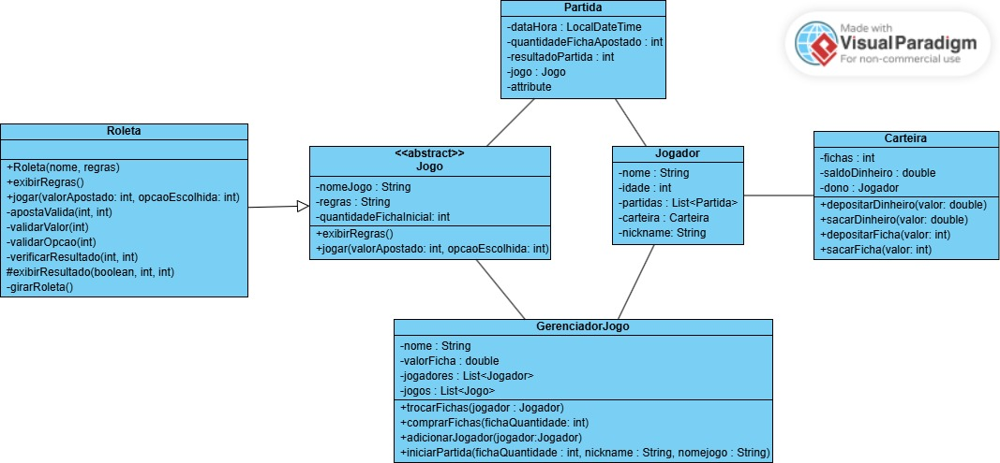

## 🃏 História e Contexto do Jogo – Império das Fichas 🎰

Em uma cidade onde as luzes nunca se apagam e a sorte é a única lei, existe uma lenda conhecida como o **Império das Fichas**. Esse lugar é frequentado por apostadores de todos os cantos do mundo, em busca de fama, fortuna e, acima de tudo, respeito.

Você é um(a) novo(a) desafiante que acaba de entrar no salão principal. Com algumas fichas no bolso e muita coragem, seu objetivo é **acumular o maior número de fichas possíveis** apostando em partidas de roleta — o jogo mais clássico e arriscado do Império.

Mas cuidado: nesse império, **a sorte muda a cada giro**, e só os mais estratégicos conseguem manter o saldo positivo até o fim da noite.

---

### 🎯 Objetivo do Jogo

O jogador começa com uma quantidade inicial de fichas. A cada rodada, pode fazer apostas:

- Em **números específicos** (ex: 17)
- Em **grupos (par ou ímpar)**

Com cada giro da roleta, o jogador descobre se venceu ou perdeu, e seu saldo de fichas é atualizado. O jogo continua até o jogador decidir sair ou ficar sem fichas.

---

### 🌍 Universo do Jogo

- Ambiente fictício de luxo com temática retrô e luzes de neon.
- Jogadores competem apenas contra a roleta (modo single player).
- Ambiente amigável, porém desafiador — o risco e a sorte estão sempre presentes.

---

## 🧩 Diagrama de Classes

O diagrama abaixo representa a estrutura do sistema **Império das Fichas**, com as classes principais, relacionamentos e responsabilidades:

<p align="center">
  
</p>

---

## 🧭 Guia do Usuário – Etapa I

Este é um protótipo funcional em Java do jogo **Império das Fichas** 🎰. Siga as instruções abaixo para compilar, executar e interagir com o sistema no terminal.

### ⚙️ Requisitos

- ☕ **Java 8 ou superior** instalado
- 💻 Ambiente de desenvolvimento (como IntelliJ, Eclipse ou terminal com `javac`)
- 📁 Estrutura de diretórios organizada conforme abaixo:

```
src/
├── controller/
│   └── GerenciadorJogo.java
├── model/
│   ├── Carteira.java
│   ├── Jogador.java
│   ├── Jogo.java
│   ├── Partida.java
│   └── Roleta.java
```

> Obs.: A `main` com o nome **Império das Fichas** ainda será implementada, mas todas as funcionalidades já estão presentes nas classes.

### 🛠️ Como Compilar

Abra seu terminal na pasta raiz do projeto e execute:

```
javac -d out src/model/*.java src/controller/*.java src/app/ImperioDasFichas.java
```

### ▶️ Como Executar

Depois da compilação, rode o programa com:

```
java -cp out app.ImperioDasFichas
```

### 🧪 Funcionalidades para Testar

- 👤 Cadastro de jogadores
- 🎰 Jogo de roleta (par ou ímpar)
- 💰 Compra e venda de fichas
- 👜 Gerenciamento de saldo em fichas e dinheiro

### 📌 Testando com Classe Main Temporária (Exemplo)

```java
package app;

import controller.GerenciadorJogo;
import model.Roleta;
import model.Jogador;

import java.util.ArrayList;

public class ImperioDasFichas {
    public static void main(String[] args) {
        Roleta roleta = new Roleta("Roleta Clássica", "Aposte em par ou ímpar");
        GerenciadorJogo jogo = new GerenciadorJogo("Império das Fichas", 5.0, new ArrayList<>());
        jogo.adicionarJogo(roleta);
        jogo.adicionarJogador(new Jogador("Ana", 21, "aninha21"));
        // continue seus testes aqui...
    }
}
```


---

## ⚠️ Erro no Commit

Durante o desenvolvimento, houve um erro em que um commit relacionado à **Parte II** do projeto foi realizado na **branch `main`**, quando deveria ter sido feito na **branch `develop`**.


---

## 🛠️ Etapa II – Em Andamento

A **Parte II** do projeto está atualmente em andamento, com funcionalidades adicionais e ajustes sendo implementados.

Fique atento às atualizações que serão feitas em breve!

---


📌 **Kanban do Projeto:**  
🔗 [Acompanhe o progresso no GitHub Projects](https://github.com/users/Gabssanjoss/projects/2/views/1)

## 👥 Millenium Falcon Developers

👩‍💼 **Tech Lead:** Gabriela Anjos  

👨‍💻 **Desenvolvedores:**
- Lucas Freitas
- William Augusto
- Robson Batista
- Silvia Cristina


